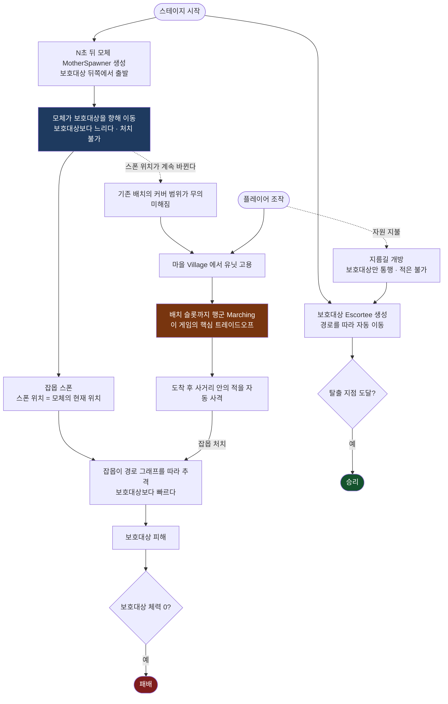
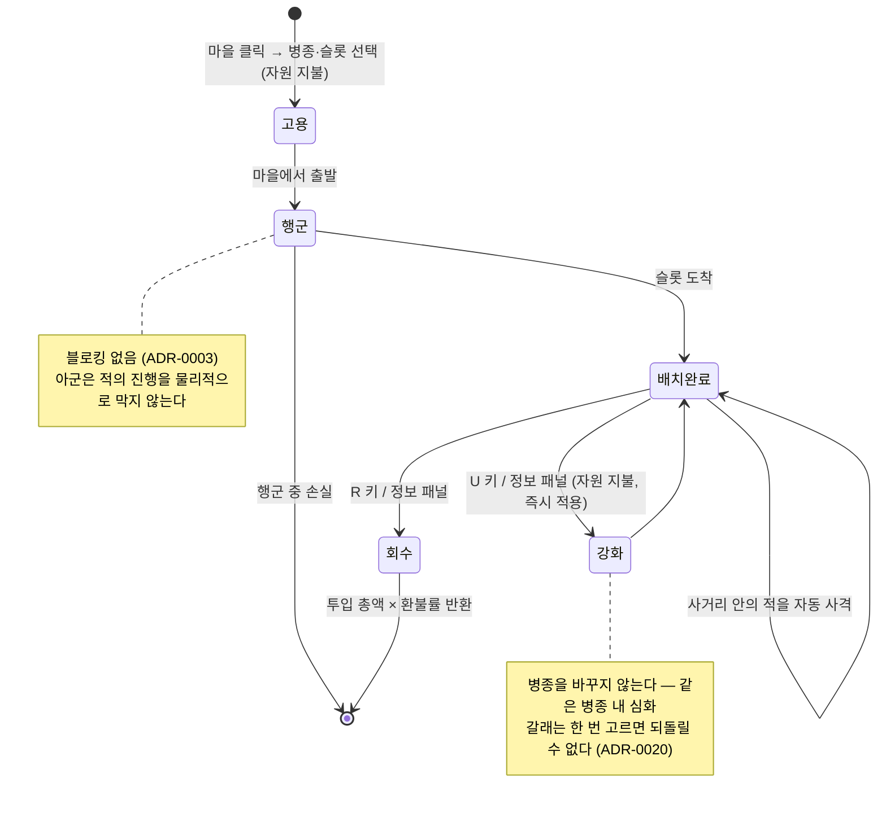

# Prowl's Moving Factory

> **이동하는 적 스폰 지점 때문에 방어선을 계속 다시 짜야 하는, 호위형 타워 디펜스.**

역(逆)타워 디펜스다. 적이 우리 진영에 오는 것을 막는 게 아니라, **우리 편(보호대상)이 반대편 출구까지 살아서 가게 만드는** 게임이다.

현재 단계는 **그레이박스 프로토타입**이다. 아트 에셋은 만들지 않는다 — 흰 사각형과 원, 색상만 쓴다.

---

## 핵심 루프

플레이어는 **"지금 여기"가 아니라 "곧 저기"에 병력을 보내야 한다.** 행군 시간이 있기 때문이다.
모체가 이동하므로 지금 위험한 곳에 병력을 보내면 도착했을 땐 이미 늦다.
이 **예측형 플레이**가 검증해야 할 1순위 가설이다.



승패 조건은 이 둘뿐이다. **자원 고갈·시간 초과·유닛 전멸은 패배가 아니다.**

| 결과 | 조건 |
|---|---|
| 승리 | 보호대상이 탈출 지점(`ExitPoint`)에 도달 |
| 패배 | 보호대상의 체력이 0 |

---

## 아군 유닛의 생명 주기

고용한 유닛은 즉시 설치되지 않는다. **마을에서 목적지까지 실제로 걸어간다**(ADR-0001).
행군 중에는 통제권이 없고(ADR-0008), 도착해서야 사격을 시작한다.



---

## 주요 개념

용어의 단일 진실 원천은 [`.docs/GDD.md`](.docs/GDD.md) §2 용어표다. 코드 식별자와 1:1로 대응한다.

| 한글 | 코드 식별자 | 한 줄 |
|---|---|---|
| 보호대상 | `Escortee` | 지켜야 하는 개체. 죽으면 패배 |
| 모체 / 추적자 | `MotherSpawner` | **처치 불가능한**, 이동하는 적 스폰 지점. 이 게임의 핵심 장치 |
| 잡몹 | `Enemy` | 모체가 뱉는 일반 적. 보호대상보다 빠르다 |
| 마을 | `Village` | 유일한 병력 공급원 |
| 유닛 | `AllyUnit` | 고용해 배치하는 아군. 자동 사격 |
| 행군 | `Marching` | 마을에서 슬롯까지 걸어가는 상태. **핵심 트레이드오프** |
| 지름길 | `ShortcutEdge` | 자원으로 여는 엣지. **보호대상만 통행, 적은 불가** |
| 자원 | `Scrap` | 고철. 단일 통화 |

병종은 고양이 수인(`CatFolk`, 근접) · 쥐 수인(`RatFolk`, 원거리) · 여우 수인(`FoxFolk`, 공속 버프)이다.

---

## 확정된 설계 결정

아래는 합의가 끝난 사항이다. 뒤집으려면 해당 ADR부터 고친다. 근거는 [`.docs/adr/`](.docs/adr/)에 있다.

| # | 결정 | ADR |
|---|---|---|
| 1 | **마을 고용 + 행군.** 즉시 설치가 아니다 | ADR-0001 |
| 2 | **직교(Rectangular) Tilemap.** Isometric 쓰지 않는다 | ADR-0002 |
| 3 | **블로킹 없음.** 사거리 안의 적을 쏘기만 한다 | ADR-0003 |
| 4 | **경로 그래프 위 고정 경로.** A*/NavMesh 도입 금지 | ADR-0004 |
| 5 | **지름길 = 분기 그래프 + 통행 권한 플래그** | ADR-0004 |
| 6 | **물리 엔진 미사용.** 사거리·충돌·클릭 판정은 전부 순수 수학 | ADR-0005 |
| 7 | **런타임 UI 는 uGUI.** UI Toolkit 쓰지 않는다 | ADR-0006 |
| 8 | **윈도우형 UI 를 띄우면 0.1배속을 건다** | ADR-0019 |

8번은 특히 새기 쉽다. 정밀 조작을 요구하는 창을 띄워 놓고 게임이 제 속도로 굴러가면
플레이어는 **창을 읽는 대가로 판을 잃는다.** `GameClock` 의 슬로우모션은 참조 계수이므로
`EnterUiSlowMotion()` / `ExitUiSlowMotion()` 의 **짝이 맞아야 한다.** 자세한 규칙은 `CLAUDE.md` §4-1.

---

## 프로젝트 구조

```
Assets/_Project/
  Scripts/
    Runtime/     → PMF.Runtime.asmdef   (네임스페이스 PMF.*)
      Actors/      Escortee, MotherSpawner, Enemy, AllyUnit, Village
      Combat/      데미지, 타겟 탐색, 사격
      Grid/        격자, 좌표 변환, 셀 타입
      Pathing/     경로 그래프, 탐색, 경로 추종
      Session/     GameSession, GameClock, Wallet, 승패
      UI/          uGUI 뷰
      Data/        ScriptableObject Definition
      Audio/       SfxPlayer
      Diagnostics/ 디버그 오버레이, 치트
    Editor/      → PMF.Editor.asmdef    (Editor 전용, Runtime 참조)
    Tests/       → PMF.Tests.asmdef     (EditMode)
  Data/          ScriptableObject .asset
  Prefabs/
  Scenes/        Stage_Greybox.unity  ← 프로토타입 씬은 이것 하나뿐
  Art/           프로토타입 단계에서는 비워 둔다
```

의존 방향은 위에서 아래로만 흐른다. **Services 가 Actors 를 알면 안 된다.**

```
UI  →  Session  →  Actors  →  Services  →  Data
```

씬 단일 서비스 싱글턴은 **`GridSystem`, `PathGraph`, `GameSession`, `GameClock` 4개만** 허용한다.
그 외에는 `[SerializeField]` 참조 주입이다.

**격자 좌표 ↔ 월드 좌표 변환은 오직 `GridSystem` 안에서만 한다.**
나중에 쿼터뷰를 도입할 때 변환 지점이 한 곳이면 그 파일만 고치면 되기 때문이다.

---

## 환경

| 항목 | 값 |
|---|---|
| Unity | **6000.5.7f1** (다른 버전으로 열지 않는다) |
| 렌더 파이프라인 | URP 17.6 / 2D Renderer |
| 입력 | Input System 1.20 (구 `Input` API 금지) |
| 대상 플랫폼 | Windows (IL2CPP) / Linux 예정 |
| UI | uGUI |
| 언어 | C# / 네임스페이스 루트 `PMF` |

**Enter Play Mode Options 로 Reload Domain 을 껐다.** 그래서 `static` 필드가 플레이 종료 후에도
값을 유지하고, `static` 이벤트 구독이 누적된다. `static` 상태를 가진 클래스에는 반드시 넣는다:

```csharp
[RuntimeInitializeOnLoadMethod(RuntimeInitializeLoadType.SubsystemRegistration)]
private static void ResetStatics()
{
    _instances.Clear();
    OnSomething = null;
}
```

`OnEnable` 에서 구독했으면 **`OnDisable` 에서 반드시 해제한다.** 예외 없다.

---

## 개발

실행 중인 에디터에 `unity` CLI 로 붙어 컴파일·콘솔·테스트를 검증한다.

```bash
unity status --no-banner                                    # state 가 "ready" 여야 한다
unity command recompile --no-banner                         # → recompile_status 로 폴링
unity command console --tail 50 --level error --no-banner
unity command run_tests --mode EditMode --no-banner
```

- CLI 가 붙지 않으면 에디터가 꺼져 있거나 **Safe Mode**(컴파일 에러로 부팅 실패)다.
  파일 직접 편집으로 도망가지 말고 컴파일 에러를 고친 뒤 재시작한다.
- **플레이 모드에서 `run_tests` 를 돌리지 마라.** 명령 큐가 배수되지 않아 파이프라인이 통째로 먹통이 된다.
  먼저 `editor_stop`.
- 씬·프리팹 연결도 CLI 로 한다. `.unity` / `.prefab` YAML 을 손으로 만지지 않는다.
- 빌드 중에 `unity command` 를 폴링하면 메인 스레드가 타임아웃되어 **빌드가 실패한다.**
  진행 상황은 `Logs/Editor.log` 를 지켜본다.

### 조작 (그레이박스 빌드 기준)

| 입력 | 동작 |
|---|---|
| 좌클릭 | 마을 → 고용 패널 / 유닛 → 선택 / 지름길 → 구매 확인 |
| 우클릭 · `ESC` | 취소 (취소할 게 없으면 `ESC` 는 일시정지 메뉴) |
| `Space` | 일시정지 토글 |
| `1` `2` `3` `4` | 1x / 2x / 4x / 0.1x 배속 |
| `R` | 선택한 유닛 회수 |
| `U` | 선택한 유닛 강화 (갈래가 둘이면 패널에서 고른다) |
| `M` | 음소거 토글 |

디버그 오버레이와 치트(`F1`~`F6`)는 `#if UNITY_EDITOR || DEVELOPMENT_BUILD` 안에 있다.
**릴리스 빌드에는 포함되지 않는다.**

---

## 문서

`.docs/` 아래가 진실이다. 코딩 전에 읽는다.

| 파일 | 내용 |
|---|---|
| [`CLAUDE.md`](CLAUDE.md) | 강제 규칙 + Unity 6 API 함정. 충돌하면 작업을 멈추고 묻는다 |
| [`.docs/GDD.md`](.docs/GDD.md) | 게임 규칙과 용어의 **단일 진실 원천** |
| [`.docs/ARCHITECTURE.md`](.docs/ARCHITECTURE.md) | 시스템 구조, **확정된 클래스/API 시그니처** |
| [`.docs/TASKS-P1-prototype.md`](.docs/TASKS-P1-prototype.md) | 프로토타입 실행 태스크 (순서대로) |
| [`.docs/TASKS-P2.md`](.docs/TASKS-P2.md) | P2 태스크. **P-21 게이트 통과 전 착수 금지** |
| [`.docs/컨셉기획서.md`](.docs/컨셉기획서.md) | 컨셉·차별점·포지셔닝 (외부 설명용). PDF 는 여기서 나온 파생물 |
| [`.docs/adr/`](.docs/adr/) | 결정과 그 이유 |
| `.docs/회의록/` | 회의 기록과 확정 결정. 날짜별, 결정 번호로 참조 |

**용어가 헷갈리면 GDD 의 용어표를, 함수 이름이 헷갈리면 ARCHITECTURE 의 시그니처를 따른다. 새로 지어내지 않는다.**

마크다운이 원본이고 PDF 는 파생물이다. 컨셉기획서를 고쳤으면 `pwsh .docs/build-pdf.ps1` 로 다시 뽑는다.

---

## 게이트

`TASKS-P1-prototype.md` 의 **P-21 플레이 테스트** 통과 조건 4개 중 **2개 이상 실패하면 다음 단계로 가지 않는다.**
아트·종족·데이터 파이프라인은 전부 이 게이트 뒤에 있다.
