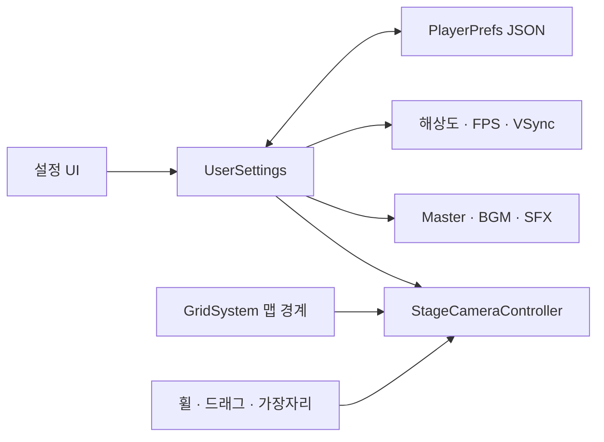

# 카메라와 환경설정

플레이 중 **ESC → 설정**에서 게임·그래픽·사운드 탭을 연다. 변경값은 즉시 적용되고 다음 실행에도 유지된다.

| 조작 | 동작 |
|---|---|
| 마우스 휠 | 확대·축소 |
| 가운데 버튼 드래그 | 카메라 이동 |
| 화면 가장자리 / 모서리 | 상하좌우 / 대각선 이동 |
| 게임 → 화면 가장자리 이동 | 자동 스크롤 켜기·끄기 |
| 그래픽 → 해상도 | 모니터 지원 해상도 선택. 실행 파일에서 적용 |
| 그래픽 → FPS 제한 | 60 / 120 / 144 / 165 / 무제한 |
| 그래픽 → VSync | 켜면 모니터 주사율 우선. 끄면 선택한 FPS 복원 |
| 사운드 | 전체 / BGM / SFX 0–100, 전체 음소거 |

카메라는 맵 전체가 보이는 크기로 시작한다. 확대 후 드래그하거나 가장자리로 커서를 옮기면 이동한다. 맵 경계 밖으로 벗어나지 않으며 UI·일시정지 메뉴 위에서는 카메라 조작을 받지 않는다.

개발 참고:

- `PMF.UserSettings.v1`에 저장하며 스테이지 에셋의 밸런스 값은 바꾸지 않는다.
- Unity Editor에서 해상도는 저장만 한다. 실제 해상도 변경은 Windows Player에서 적용한다.
- 씬의 `BGM` AudioSource에 음악 클립을 지정하면 BGM 음량이 적용된다. 현재 음악 클립은 제공되지 않았다.
- 씬 재생성 시 카메라와 오디오 컴포넌트도 다시 연결된다. 맵 크기와 원점은 임포트된 MapDefinition을 따른다.
- 기존 난이도 변경·재시작은 유지한다. 스테이지 선택 및 콘텐츠 제작은 이번 변경에 포함되지 않는다.
